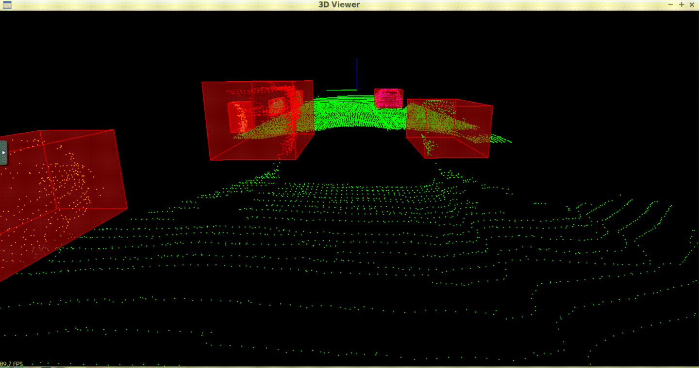

# Lidar and The Point Cloud Library (PCL)

This project is the first in a series for Udacity's Sensor Fusion Nanodegree. The project covers the following key concepts:

- Lidar point cloud processing under real-time constraints
- RANSAC for ground plane segmentation
- K-D tree data structure for Euclidean distance clustering

Some other topics covered include:
- Point cloud simulation by raycasting
- Voxels 

## Visualization of the results


## Build and run on macOS
```
brew install pcl
mkdir build
cd build
cmake ..
make
./environment
```

## Overview of the point cloud processing pipeline
1. Load one point cloud frame from a `.pcd` file
1. [Downsample](http://pointclouds.org/documentation/tutorials/voxel_grid.php) to voxels
1. Determine and crop to the region of interest, excluding vehicle roof interference
1. Use random sample consensus (RANSAC) to locate and segment the ground plane
1. Use a k-d tree (with k=3 dimensions) and a Euclidean distance tolerance to cluster the remaining obstacle points
1. Render a bounding box around each cluster
1. _Repeat_

## Comments
While the results are visually impressive, this implementation relies on hand selected hyperparameters. These include the extent of the region of interest and upper/lower bounds on the number of points in a cluster, among others. This hand tuned approach seems too brittle for general use.

The current pipeline operates on a frame by frame basis, so there is no link from an obstacle in one frame to the next. Adding object tracking is the next step, and would require comparing the characteristics and relative motion of each cluster between frames.

The quantity of data produced by a lidar system is enormous. For the Velodyne HDL 64, it's 2,800,000 `XYZI` points per second!
```
64 horizontal layers
0.08 degrees angular resolution (360 / 0.08 = 4500 rays)
10 Hz refresh rate
```
The techniques covered in this project, such as downsampling to voxels, and searching assisted by k-d trees, make clustering this massive dataset a tractable problem.
